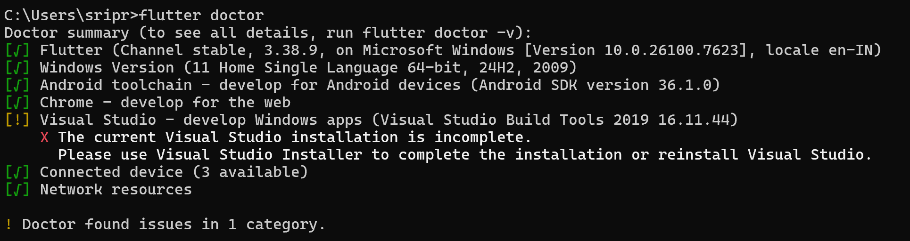
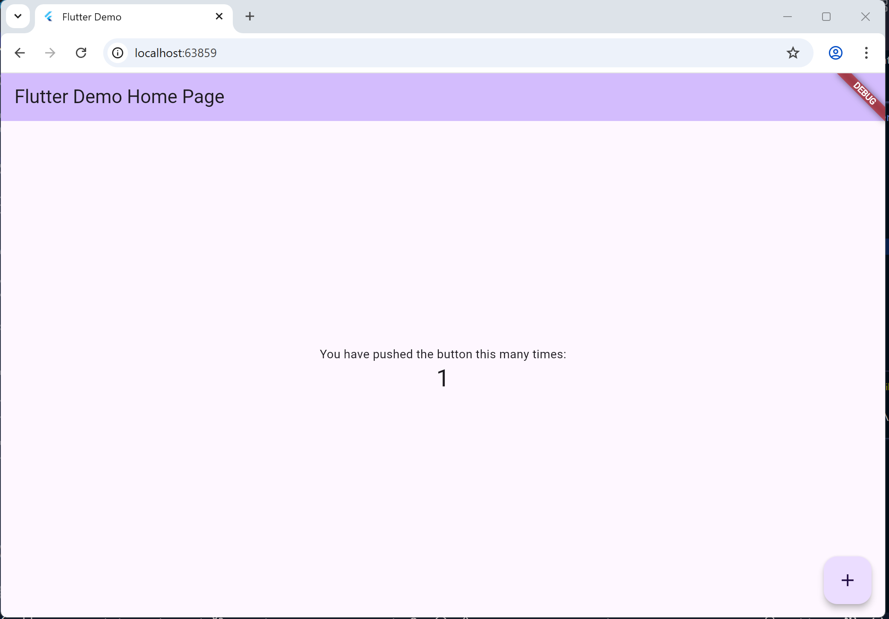

📚📱 Smart Library App

Smart Library App is a cross-platform mobile application built using Flutter 🦋 and Firebase 🔥 to modernize public library systems. Traditional libraries rely on manual registers for tracking book availability and borrowing, which limits accessibility and efficiency.

This app provides a simple and user-friendly digital solution where users can 🔍 discover books, ✅ check real-time availability, 📌 reserve books, and 📊 track borrowing status directly from their mobile devices.

The project uses Flutter 🦋 for building responsive UI, Dart 💻 as the programming language, and Firebase 🔥 for authentication and real-time data management. It is developed as part of Kalvium – Simulated Work Sprint #2 🚀, focusing on modern mobile app architecture and seamless backend integration.


Concept-1
## **Concept 1** ##

# Modern Library Management System – Concept Overview

# Smart Library App (eLibrary Hub)

Smart Library App is a cross-platform mobile application built with Flutter and Firebase to modernize public library systems. This repository contains the Flutter app source and service integrations used during the Kalvium sprint.

## What I changed in this repo

- Added a simple, modular `lib/main.dart` Welcome screen (replaces default counter app).
- Documented project structure, setup steps, naming conventions, and run instructions below.

## 1) Flutter environment — quick setup & verification

1. Install Flutter SDK (https://flutter.dev/docs/get-started/install) and your IDE (Android Studio or VS Code).
2. Install Flutter & Dart extensions in VS Code or Android Studio.
3. Verify installation in a terminal:

```bash
flutter doctor
```

4. Create a new Flutter project (if you need a fresh project):

```bash
flutter create your_project_name
cd your_project_name
```

5. Run the app on an emulator or device:

```bash
flutter run
```

If you see the default Flutter demo app or the new Welcome screen, your environment is set up.

## 2) Folder structure (used in this project)

lib/
- main.dart          # Entry point and app-level routing/widgets
- screens/           # Individual UI screens (one screen = one Dart file)
- widgets/           # Reusable UI components (buttons, cards, etc.)
- models/            # Plain data classes and serialization helpers
- services/          # Firebase or API logic (`auth_service.dart`, `firestore_service.dart`)

Explanation:
- Keep UI (`screens`/`widgets`) separate from business logic (`services`) and data (`models`).
- `main.dart` wires the app together and sets up top-level providers or Firebase initialization.

How this supports modular design:
- Each screen is independent and can be developed/tested in isolation.
- Services encapsulate backend logic so UI code only calls simple methods.
- Models define the data schema, making serialization/deserialization consistent.

## 3) Naming conventions

- Files: use snake_case (e.g., `auth_service.dart`, `book_list_screen.dart`).
- Classes: use UpperCamelCase (e.g., `AuthService`, `BookListScreen`).
- Widgets: use descriptive names ending with `Screen` or `Widget` (e.g., `WelcomeScreen`, `BookCard`).

Reasoning: these conventions match community conventions and keep files discoverable.

## 4) Run & verify the included Welcome screen

1. Ensure you are in the project root.
2. Run:

```bash
flutter pub get
flutter run
```

3. The app will start and show a Welcome screen with an AppBar, title text, a book icon, and a button that toggles text/color state.

## Files to look at

- [lib/main.dart](lib/main.dart)
- [lib/services/auth_service.dart](lib/services/auth_service.dart)
- [lib/services/firestore_service.dart](lib/services/firestore_service.dart)


## **3.11 Setting Up Flutter SDK, Android Studio, and First Emulator Run** ##

Got it 😄 — clean, simple, and complete in one go.

Here is your final README content 👇

---

# 🚀 Flutter Environment Setup and First App Run

## 📌 Overview

This assignment involved installing and configuring the Flutter development environment and successfully running the first Flutter application on an emulator.

The setup establishes a complete development environment for future Flutter and Firebase projects.

---

## 🛠 Steps Followed

### 1️⃣ Installed Flutter SDK

* Downloaded Flutter SDK from the official website.
* Extracted it to `C:\flutter`.
* Added `C:\flutter\bin` to the system PATH.
* Verified installation using:

```
flutter doctor
```

---

### 2️⃣ Installed and Configured Android Studio

* Installed Android Studio.
* Installed required components:

  * Android SDK
  * SDK Platform Tools
  * Command-line tools
  * Android Virtual Device (AVD)
* Accepted licenses using:

```
flutter doctor --android-licenses
```

---

### 3️⃣ Created and Configured Emulator

* Opened AVD Manager.
* Created a virtual device (Pixel device, Android 13+).
* Launched emulator.
* Verified device using:

```
flutter devices
```

---

### 4️⃣ Created and Ran First Flutter App

Created a new project:

```
flutter create first_flutter_app
```

Ran the app using:

```
flutter run
```

The default Flutter counter app successfully launched on the emulator / Chrome.

---

## ✅ Setup Verification

### 📷 Flutter Doctor Output

(Screenshot added here showing all green checks)

### 📷 Running App on Emulator

(Screenshot added here showing default counter app)

---

## 🧠 Reflection

During installation, I faced issues related to PATH configuration, SDK placement, and Android toolchain setup. Initially, Flutter was not recognized due to environment variable misconfiguration. Additionally, Android command-line tools and licenses needed to be installed and accepted manually.

Resolving these issues helped me better understand how development environments work, how SDK paths interact with system variables, and how Flutter connects with Android toolchains.

This setup prepares me for building and testing real mobile applications by ensuring I can confidently run, debug, and deploy Flutter apps across devices. It also strengthens my troubleshooting skills, which are essential for real-world development.



